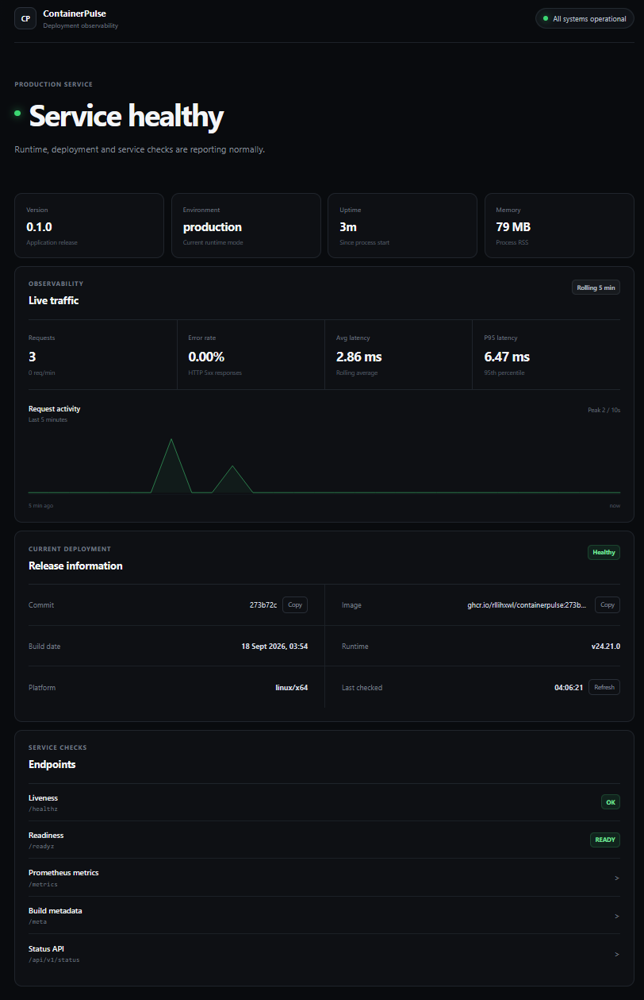

# ContainerPulse

[](https://github.com/rllihxwl/containerpulse/actions/workflows/ci.yml)

ContainerPulse is a lightweight self-hosted service health and deployment observability dashboard.

It provides runtime status, health checks, release metadata, HTTP traffic metrics and Prometheus metrics from a small Docker container.

The project is designed to be easy to deploy on a VPS, home server, NAS or local machine without requiring external databases or infrastructure.

## Dashboard



## Features

- Web observability dashboard
- Liveness and readiness checks
- Runtime and build metadata
- Request and error metrics
- Average and P95 latency
- Rolling 5-minute traffic statistics
- Prometheus metrics endpoint
- Docker health check
- Graceful shutdown
- Non-root container runtime
- Read-only container filesystem
- Dropped Linux capabilities
- Resource limits
- Automated tests
- Container vulnerability scanning
- SBOM generation
- Signed build provenance
- GitHub Container Registry publishing

## Quick start

### Requirements

You only need:

- Docker
- Docker Compose

### Install

```bash
git clone https://github.com/rllihxwl/containerpulse.git
cd containerpulse
cp .env.example .env
docker compose up -d --build
```

ContainerPulse will be available at:

```text
http://localhost:3000
```

On a remote server, replace `localhost` with the server IP or place ContainerPulse behind a reverse proxy such as Nginx or Caddy.

## Configuration

ContainerPulse works without changing any configuration.

Available options are documented in `.env.example`:

```env
CONTAINERPULSE_PORT=3000
NODE_ENV=production

CONTAINERPULSE_IMAGE=containerpulse:local

CONTAINERPULSE_PIDS_LIMIT=100
CONTAINERPULSE_MEMORY_LIMIT=256m
CONTAINERPULSE_CPU_LIMIT=1.0
```

Copy the example before making local changes:

```bash
cp .env.example .env
```

The `.env` file is ignored by Git.

## Endpoints

| Endpoint | Purpose |
| --- | --- |
| `/` | ContainerPulse dashboard |
| `/healthz` | Liveness check |
| `/readyz` | Readiness check |
| `/meta` | Build and release metadata |
| `/api/v1/status` | Runtime and traffic status |
| `/api/v1/hello` | Example application endpoint |
| `/metrics` | Prometheus metrics |

### Health check

```bash
curl http://localhost:3000/healthz
```

Example response:

```json
{
  "status": "ok"
}
```

### Readiness check

```bash
curl http://localhost:3000/readyz
```

### Service status

```bash
curl http://localhost:3000/api/v1/status
```

The status API exposes information used by the dashboard, including:

- uptime
- memory usage
- request count
- error rate
- average latency
- P95 latency
- recent request activity

### Prometheus

Prometheus-compatible metrics are available at:

```text
http://localhost:3000/metrics
```

## Docker

The production container is intentionally restricted.

It:

- runs as a non-root user
- uses a read-only root filesystem
- drops all Linux capabilities
- enables `no-new-privileges`
- uses a temporary `/tmp`
- has CPU, memory and PID limits
- includes a Docker health check
- handles SIGTERM and SIGINT gracefully

Check container status:

```bash
docker compose ps
```

View logs:

```bash
docker compose logs -f app
```

Stop ContainerPulse:

```bash
docker compose down
```

## Updating

Pull the latest source and rebuild:

```bash
git pull
docker compose up -d --build
```

Docker Compose will recreate the application container using the new version.

## Container image

CI builds and publishes ContainerPulse images to GitHub Container Registry:

```text
ghcr.io/rllihxwl/containerpulse
```

Available image tags include:

```text
latest
<git-commit-sha>
```

Images built from `main` include build metadata, an SBOM and provenance information.

## Observability

ContainerPulse collects lightweight in-memory HTTP statistics.

The dashboard currently tracks:

- total requests
- requests per minute
- server errors
- error percentage
- average response latency
- P95 response latency
- recent traffic activity

Health, readiness, metrics and internal dashboard requests are excluded from application traffic statistics.

Metrics are intentionally stored in memory, so they reset when the container restarts.

## CI/CD

Every change to `main` goes through the GitHub Actions pipeline.

The pipeline performs:

```text
Tests
  |
  v
Dependency audit
  |
  v
Container build
  |
  v
Trivy vulnerability scan
  |
  v
GHCR publish
  |
  v
SBOM + provenance
  |
  v
Signed attestation
```

High and critical container vulnerabilities fail the security job.

## Project structure

```text
.
в”њв”Ђв”Ђ .github/
в”‚   в””в”Ђв”Ђ workflows/
в”њв”Ђв”Ђ public/
в”њв”Ђв”Ђ src/
в”њв”Ђв”Ђ test/
в”њв”Ђв”Ђ .env.example
в”њв”Ђв”Ђ Dockerfile
в”њв”Ђв”Ђ docker-compose.yml
в”њв”Ђв”Ђ index.js
в”њв”Ђв”Ђ package.json
в””в”Ђв”Ђ README.md
```

## Tech stack

- Node.js 24
- Fastify
- Docker
- Docker Compose
- Prometheus client
- GitHub Actions
- Trivy
- GitHub Container Registry

## Design goals

ContainerPulse intentionally keeps its infrastructure small.

It does not require:

- PostgreSQL
- Redis
- Kubernetes
- external monitoring services

The goal is to provide useful service and deployment visibility while remaining easy to understand, deploy and maintain.

## License

This project is licensed under the MIT License. See LICENSE for details.


